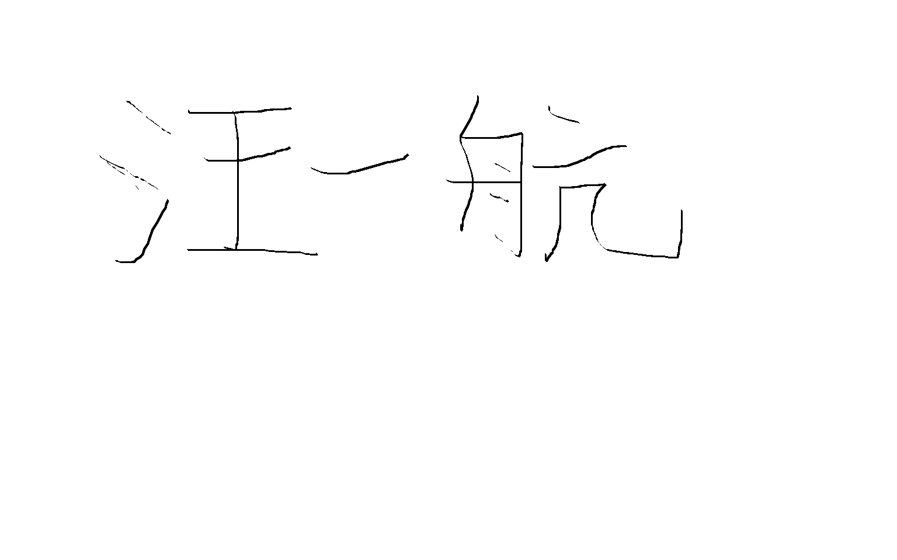

# **CampusHub 项目团队组织与角色分工书**

**项目周期：** 10周 (W1 \- W10)

**团队名称：** CampusHub 智协小组

**文档版本：** V1.0 (P0 阶段确认)

## **一、 团队成员名单**

| 成员姓名 | 初始角色 | 核心技术栈 |
| :---- | :---- | :---- |
| **郑嘉鸿** | 需求负责人 (组长) | 业务建模、产品设计 |
| **汪一航** | 架构负责人 | Spring Boot、后端系统架构 |
| **何刘磊** | 开发负责人 | Vue 3、前端组件开发 |
| **杨宗乔** | 测试负责人 | 质量保证、自动化测试 |

## **二、 角色职责定义**

### **1\. 需求负责人 (Requirement Lead)**

* **核心职责**：用户访谈、需求获取、编写用例建模（Use Case）、确定 MVP 范围。  
* **交付物**：SRS 需求规格说明书、UI 原型、验收标准。

### **2\. 架构负责人 (Architecture Lead)**

* **核心职责**：技术选型决策、前后端分离架构设计、撰写架构决策记录 (ADR)、系统组件图设计。  
* **交付物**：体系结构设计文档、ADR 记录、Monorepo 骨架。

### **3\. 开发负责人 (Development Lead)**

* **核心职责**：数据库 ER 图设计、RESTful API 定义、核心模块编码、代码审查规范制定。  
* **交付物**：数据库 Schema、API 文档 (Swagger)、核心功能代码。

### **4\. 测试负责人 (QA/Testing Lead)**

* **核心职责**：制定测试策略、设计测试用例、执行集成测试、性能优化建议及安全扫描。  
* **交付物**：测试用例库、单元测试报告、质量分析报告。

## **三、 阶段性角色轮换计划 (W1 \- W10)**

根据项目敏捷开发的性质，我们设置了动态轮换机制，确保每位成员都能在不同阶段主导核心工作：

| 阶段 | 周期 | 核心任务 | 主导角色 (Lead) | 协作成员任务 |
| :---- | :---- | :---- | :---- | :---- |
| **P0 启动** | W1 | 工具链选型、签署契约、CI 搭建 | **需求负责人 (郑嘉鸿)** | 全员参与工具评估与环境初始化 |
| **P1 需求** | W2-3 | 用例建模、确定 MVP | **需求负责人 (郑嘉鸿)** | 开发人员协助可行性评估 |
| **P2 架构** | W4 | 技术选型、架构设计 | **架构负责人 (汪一航)** | 开发负责人协助技术调研 |
| **P3 设计** | W5 | 数据库设计、API 定义 | **开发负责人 (何刘磊)** | 测试负责人同步设计测试点 |
| **P4 编码** | W6-7 | 核心模块实现 | **开发负责人 (何刘磊)** | 测试负责人进行集成测试 |
| **P5 完善** | W8 | P1 功能实现、联调 | **架构负责人 (汪一航)** | 全员参与 Bug 修复 |
| **P6 质量** | W9 | 重构、性能优化 | **测试负责人 (杨宗乔)** | 开发负责人配合修复安全问题 |
| **P7 交付** | W10 | 报告整理、答辩准备 | **需求负责人 (郑嘉鸿)** | 全员参与 Demo 录制 |

## **四、 团队沟通与决策协议**

1. **每日立会 (Stand-up)**：通过在线会议或 IM 工具沟通前日进度、当日计划及阻塞点。  
2. **AI 协作一致性**：所有成员在编码时必须遵守《AI 协作契约》，严禁私自绕过 Review 合入代码。  
3. **主导权原则**：在对应阶段，主导负责人拥有该阶段交付物的最终决定权，其他成员提供辅助支持。

### **五、AI 工具链选型**

**针对本项目全链路协同，选定以下 AI 工具：**

* **编程助手：Cursor（支持全仓库索引，适合 Monorepo 架构）**  
* **对话决策：Claude 4.6（逻辑严谨，适合需求分析与架构设计）**  
* **代码审查：CodeRabbit（集成于 GitHub Actions，提供自动 PR 评审）**  
* **测试增强：Qodo（用于自动化生成 JUnit 测试模板）**

**全体成员签名：**
| 需求负责人 | 架构负责人 | 开发负责人 | 测试负责人 |
| :---: | :---: | :---: | :---: |
|  **郑嘉鸿** |  **汪一航** |  **何刘磊** |  **杨宗乔** |
| 2026-04-12 | 2026-04-12 | 2026-04-12 | 2026-04-12 |