# 校园互助平台 — 架构设计文档

---

## 一、架构概览

针对四人本科生团队、十周开发周期（约合 240 人时总工作量），以及部署环境的客观约束，本系统的架构设计以 **"保交付、控边界、反过度工程化"** 为核心准则。

经过深入论证，本项目坚决摒弃了会带来庞大网络运维开销与联调灾难的微服务架构（Microservices Architecture）。同时，为了避免传统分层单体架构在项目后期演变为逻辑相互缠绕的 **"大泥球"（Big Ball of Mud）** 反模式，本系统最终确立采用 **模块化单体架构（Modular Monolith）** 作为全局架构风格。

在该架构风格下，系统保留了单体应用 **单一进程、单代码库、单一数据库连接池** 的部署便利性。所有业务代码在同一个 Spring Boot 进程中运行，享受零网络序列化开销与本地强事务保障。同时，系统在内部按照领域驱动设计（DDD）的理念被垂直划分为 **4 个高内聚的业务模块**。模块之间严格禁止直接访问对方的数据库表，必须通过显式定义的进程内接口（In-process Interfaces）进行通信，从而在 **物理极简与逻辑隔离** 之间取得了完美平衡。



---

## 二、模块划分说明

为了在十周内确保高质量的工程交付，避免开发时的代码合并冲突与过度设计，本系统基于领域驱动设计（DDD）的业务边界，将系统划分为 **4 个高度内聚的核心模块**。

### 2.1 模块的职责边界

各个模块遵循 **"对外暴露接口、对内隐藏实现"** 的原则，严禁跨模块直接操作数据库。

#### ① User-Auth — 用户与身份模块

| 维度 | 说明 |
| :--- | :--- |
| **核心职责** | 管理系统的准入与用户身份生命周期。负责学号与校园邮箱的核验登录；管理用户个人资料（头像、昵称等）与角色状态 |
| **隔离边界** | 作为基础支撑模块，仅对外提供统一的用户基础信息查询接口，并在接口层执行学号脱敏显示（仅显示末四位）逻辑。**绝对不关心**用户发布了什么需求或完成了什么订单 |

#### ② Order-Hub — 需求与订单中枢

| 维度 | 说明 |
| :--- | :--- |
| **核心职责** | **系统的绝对业务中枢**。将"需求大厅"与"订单流转"合二为一，统一维护核心业务的完整生命周期。处理需求发布、匿名机制，以及接单、进行中、确认、评价等完整的状态机扭转；同时负责拍照存证闭环和争议订单的数据记录 |
| **隔离边界** | 系统中 **唯一** 允许修改订单与任务状态的地方。所有对订单状态的干预必须调用该模块暴露的 API 进行驱动 |

#### ③ Asset-Ledger — 资产与结算模块

| 维度 | 说明 |
| :--- | :--- |
| **核心职责** | 管理用户的无形资产与信用体系。负责处理虚拟积分"校邻币"的流水，确保发单扣除与接单增加的强事务一致性；同时负责计算双向打分，并实时折算为信誉等级标识 |
| **隔离边界** | 采用"复式记账"思想，只负责账户余额的计算与流水记录，**绝不反向依赖** 具体的订单流转逻辑 |

#### ④ Rec-Filter — 推荐与旁路辅助模块

| 维度 | 说明 |
| :--- | :--- |
| **核心职责** | 处理非核心主链路的可用性增强服务。负责违规敏感词的实时拦截；利用轻量级 SQL 聚合计算提供基于用户历史行为的基础推荐；并在关键节点分发站内 WebSocket 消息通知 |
| **隔离边界** | 作为旁路辅助模块，其故障不得影响核心交易链路的可用性 |

---

### 2.2 模块间的依赖关系

为防止架构腐化，各模块间的依赖关系必须被严格定义为 **有向无环图（DAG）**，底层模块不得反向依赖上层模块。



**依赖规则解读：**

- **User-Auth** 位于最底层，作为绝对基座被所有上层业务模块（Order-Hub, Asset-Ledger, Rec-Filter）单向调用
- **Order-Hub** 位于模块化单体的最顶层（调度层）。作为业务主入口，它向下呈辐射状发起强依赖（同步调用）：调用 User-Auth 查询发单人信息，调用 Rec-Filter 进行发布前违规校验，调用 Asset-Ledger 执行结算。
- **Asset-Ledger & Rec-Filter** 位于中间层。横向上，二者互不依赖，实现业务解耦；纵向上，二者均单向向下依赖 User-Auth 获取操作主体归属。特别地，Rec-Filter 除了接受 Order-Hub 的同步强依赖外，还通过监听 Order-Hub 派发的异步事件（弱依赖虚线）来触发后续的站内信通知动作。

---

### 2.3 模块间的接口与数据格式

为了最大化利用系统性能并降低复杂性，本系统在 Spring Boot 环境下，模块间的通信遵循以下 **极简与解耦** 的契约规范：

#### 调用方式 — 本地方法调用

模块间通信 **不通过 HTTP 网络请求（RPC 或 REST）**，而是通过 Spring 的依赖注入（Dependency Injection）进行本地 Java 方法直接调用。针对无需即时返回结果的旁路通知（如订单完成后发站内信），则采用 Spring ApplicationEvent 进行异步解耦。

#### 数据契约红线 — 严禁 Entity 越界

为了保证模块的独立性，**绝对禁止** 在接口中传递带有数据库注解（如 `@TableName`）的 Entity 实体对象。模块间传递数据必须使用原生的 Java Record 或自定义的 DTO（Data Transfer Object）。

#### 代码接口示例（以 OrderHub 扣款为例）

```java
// Asset-Ledger 模块对外暴露的契约接口
public interface AssetTransferService {
    /**
     * 执行校邻币转账操作
     * @param request 封装的转账不可变对象
     * @return 交易流水号
     */
    String transferCoins(CoinTransferDTO request);
}

// Data Transfer Object 定义 (使用 Java 17+ Record 确保字段不可变)
public record CoinTransferDTO(
    Long fromUserId,       // 付款方
    Long toUserId,         // 收款方
    BigDecimal amount,     // 交易金额
    String bizOrderNo,     // 关联的业务订单号
    String remark          // 交易备注
) {}
```

> **设计收益**：此种隔离设计确保了当 `Asset-Ledger` 内部的流水账本表结构发生任何修改时，只要 `CoinTransferDTO` 映射逻辑保持正确，作为调用方的 `Order-Hub` 模块就不需要修改任何一行代码，实现了极高的可维护性。

---

## 三、技术选型说明

本项目的技术栈选型紧扣 2026 年最新稳定技术规范，抵制引入不必要组件，兼顾了本科生的学习曲线与敏捷开发的最佳实践。

| 层次 | 选择 | 选择理由 |
| :--- | :--- | :--- |
| **前端框架** | Vue 3.x + Vite + Pinia | Vue 3 的 Composition API 提供了更优秀的逻辑复用能力。Vite 基于原生 ES 模块的冷启动机制，即使在资源受限的 WSL2 环境中也能实现毫秒级热更新。Pinia 替代了 Vuex，去除了冗余的 mutations，代码体积仅约 1.5KB 且天然具备 TypeScript 完美推导 |
| **后端框架** | Spring Boot 3.5.0 | 采用最新版核心框架，3.5.0 版本提供了更强健的结构化日志（Structured Logging）以及简化的过滤器配置。这能帮助学生团队更快速地定位报错并实现复杂的身份拦截器 |
| **数据库** | MySQL 8.0+ | 作为关系型数据库的核心，MySQL 8.0 完整支持公共表表达式（CTE）和窗口函数。这对于系统不依赖任何机器学习库，纯粹依靠复杂 SQL 实现"历史行为简单推荐"这一 P2 级核心需求至关重要 |
| **持久层扩展** | MyBatis-Plus | 基于基础代码编写能力的现状，MyBatis-Plus 内置的通用 Mapper 和条件构造器能自动生成 CRUD 操作。这使得团队可将宝贵的人时投入到核心状态机的开发中，而非手写重复的 SQL 语句 |
| **中间件（缓存）** | Redis | 负责高频会话（Token）管理、违规词库的内存级校验以及大厅分类列表的缓存。Redis 的引入是确保"核心页面加载时间 < 5 秒"这一性能红线的关键技术保障 |
| **中间件（通信）** | WebSocket (Spring SimpMessaging) | 传统的长轮询（Long Polling）极耗费 Tomcat 线程池。针对订单状态变更与站内信通知，采用 WebSocket 建立全双工通信，能够在毫秒级向前端推送接单与评价通知，避免请求积压 |
| **工程管理** | Monorepo (pnpm workspaces + Maven) | 前端采用 pnpm，后端采用 Maven 多模块。单体大仓库允许一次 git clone 获取全栈代码，避免了多仓库导致的前后端版本不一致问题，极大降低了沟通成本 |
| **部署方式** | Docker Compose | 将 MySQL、Redis、前端静态资源及 Spring Boot JAR 的容器统一定义于 docker-compose.yml 中。实现本地 Windows/Ubuntu 环境的一键拉起，彻底消除"在我电脑上能跑"的经典团队协作困境 |

---

