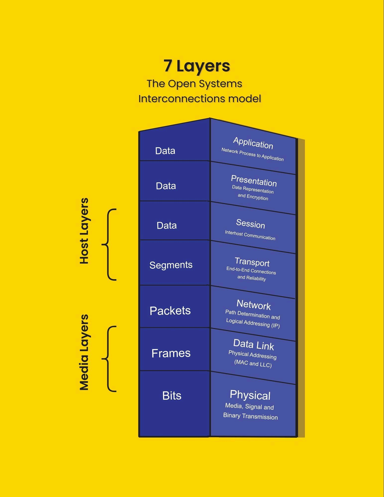
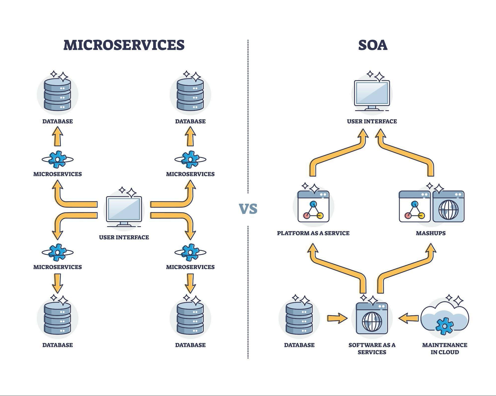

# AI辩论记录 #

- 成员 A：直接问"推荐什么架构"
问：我要做一个校园互助系统，请问你推荐什么架构

答：对于校园互助系统这类涉及高并发请求（如失物招领瞬时流量）、多端接入（小程序、H5、App）以及功能模块解耦（任务发布、即时通讯、积分商城）的应用，我推荐采用 前后端分离的微服务架构（对于学生作业或初创项目可先采用单体演进式架构）。
以下是针对校园场景设计的典型架构方案：
1. 逻辑架构设计前端层 (Client)
多端适配： 建议以 微信小程序 为主（校园社交属性强，无需下载），配合 Vue.js 或 React 编写的 H5 页面。
状态管理： 使用 Pinia 或 Redux 处理用户信息和任务状态。网关层 (API Gateway)功能： 统一入口，负责路由转发、权限校验（JWT验证）、限流（防止恶意刷单）和跨域处理。
技术选型： Spring Cloud Gateway 或 Nginx。
核心业务层 (Service Layer)
为了保证系统的可扩展性，建议将功能划分为独立的微服务：
用户中心： 集成校园统一身份认证（如学号登录）、个人信用分系统。
任务/互助中心： 处理发布、抢单、状态流转（待接单 -> 进行中 -> 已完成）。
消息中心： 实时通知（订单提醒、留言回复），建议使用 WebSocket 实现即时通讯。
搜索服务： 使用 Elasticsearch 对海量帖子和需求进行关键词检索。
2. 数据存储架构关系型数据库 (MySQL)：
 存储核心业务数据，如用户信息、任务订单、学校组织架构。
缓存层 (Redis)：
 * 热点数据： 存储校园内最热门的求助帖子。
分布式锁： 在“抢单”场景下，防止多个同学抢到同一份悬赏。
文件存储 (MinIO/OSS)： 存储任务相关的图片、音视频证明。
3. 技术栈推荐
维度推荐技术理由后端框架Spring Boot / Spring Cloud社区生态最丰富，适合处理复杂业务逻辑。数据库MySQL 8.0稳定，支持 JSON 字段方便存储扩展属性。消息中间件RabbitMQ / RocketMQ用于任务状态变更后的异步通知（如扣除积分、发送短信）。容器化Docker + K8s方便在校园服务器上快速部署和扩容。4. 校园场景下的特殊设计安全与审核机制：由于是校园内部系统，必须加入 敏感词过滤 和 人工审核流。可以使用图片识别 API 对用户上传的内容进行违规检测。信用分体系：建立类似“校园信用”的逻辑，取消单子或违约会扣分，低信用用户限制接单。

- 成员 B：提供详细项目约束后问
问：【项目背景】
我们是一个4人软件工程（智能化软件）专业大二学生团队，正在开发一个名为 CampusHub 的校园互助服务平台。开发周期共10周，目前进入第4周（体系结构设计阶段）。计划在第6-7周集中编码，最终交付可运行的MVP。

【核心功能】
P0（必做） 用户管理，注册、登录、个人资料
P0（必做） 需求发布与浏览，发布、列表、详情、筛选
P0（必做） 订单流程管理，完整的接单-完成流程
P1（应做） 评价与信用体系，双向评分、信用分
P1（应做） 消息通知，站内通知
P2（可选） 智能匹配与推荐，基础推荐算法
P2（可选） 管理后台，数据看板
P2（可选） 即时通讯，一对一消息

【非功能约束】
性能：核心页面加载时间 < 2 秒
安全：密码加密存储，防止SQL 注入和 XSS 攻击
可用性：界面简洁，核心操作路径不超过 3 步
可维护性：代码结构清晰，关键模块有单元测试

【团队与技术约束】
1. 4人全栈开发
2. 技术栈不限，但希望前后端分离
3. 10周内必须完成，要求开发效率高、学习曲线平滑
4. 希望架构支持后续扩展（如添加智能推荐、WebSocket消息）

【任务要求】
请基于以上约束，推荐一种最适合我们的架构风格。请按以下格式回答：
1.  推荐的架构风格名称
2. 推荐理由（结合上述每个约束说明为什么合适）
3. 实现可能遇到的困难及应对建议
4. 对技术栈的具体建议（前端框架、后端框架、数据库、ORM等）

答：1. 推荐的架构风格名称
前后端分离 + 单体分层架构（Layered Architecture）
（后端采用经典的三层/四层结构：Controller、Service、DAO；前端为独立单页应用）

2. 推荐理由
约束维度    具体说明
4人全栈开发，10周期限    单体分层架构代码组织清晰，分工明确（可一人负责前端，三人按模块拆分后端层），无需处理服务发现、分布式事务等复杂问题，开发效率最高。学习曲线平滑，大二学生能快速上手。
前后端分离    天然支持：前端独立部署（如Vue/React），后端提供RESTful API。团队可并行开发前后端，仅依赖接口文档。
核心功能（P0）与扩展（P2）    分层架构下，新增功能（如智能匹配、WebSocket消息）只需添加对应的Controller/Service/DAO，或独立模块；后期若性能瓶颈显著，可将热点模块拆分为微服务，改造成本较低。
非功能：性能（<2秒）    单体应用内调用链短（进程内通信），无网络跳转；数据库索引优化+Redis缓存可在分层架构中轻松集成，满足页面加载<2秒。
非功能：安全    后端统一在Service层做参数校验、SQL防注入（ORM框架自动处理）、XSS过滤；密码使用bcrypt加密。分层架构便于集中安全控制。
非功能：可用性（操作≤3步）    前端负责路由与交互优化，后端API设计遵循RESTful资源导向，逻辑清晰，可保证核心路径（发布需求→接单→完成）步骤简洁。
非功能：可维护性    分层强制分离关注点：Controller只接收请求，Service写业务，DAO操作数据。单元测试可针对每层Mock，关键模块覆盖率容易达标。
支持后续扩展（即时通讯+推荐）    WebSocket可独立服务（或使用Socket.io），与主应用通过RPC/消息队列解耦；推荐算法可封装为一个Service方法（初期简单协同过滤），不影响整体架构。
3. 实现可能遇到的困难及应对建议
困难    应对建议
前后端接口定义频繁变更    开发前使用Swagger/OpenAPI生成接口文档，约定JSON格式；先定义接口再并行开发。
多人协作时的代码冲突（后端同仓库）    严格按功能分支开发（Git Flow），每个功能对应一组Controller+Service+DAO，避免同时修改同一文件。
数据库设计不合理导致后期返工    第4周（体系结构设计阶段）用ER图工具（如dbdiagram.io）充分建模，重点关注订单、评价、用户之间的关联。
WebSocket集成与认证共享    即时通讯作为独立服务时，复用后端JWT认证：在WebSocket握手时携带token，服务端验证后建立连接。初期可先不做P2的即时通讯。
单元测试覆盖率不足    优先测试Service层核心逻辑（订单状态流转、信用分计算），使用Mockito模拟DAO；Controller层用Postman/Newman做集成测试。
部署与联调环境不一致    使用Docker Compose统一环境（MySQL+Redis+后端+前端Nginx），每人本地可启动完整栈。
4. 技术栈的具体建议
层次    推荐技术    理由
前端框架    Vue 3 + Vite + Pinia    学习曲线平缓，中文文档丰富；组合式API适合模块化开发；Pinia状态管理轻量。Vite构建快，提升迭代效率。
UI组件库    Element Plus    提供完整的后台/移动端组件（表单、列表、消息提示），符合“界面简洁、操作≤3步”要求，无需从零造轮子。
后端框架    Spring Boot 3 + Java 17    生态成熟，学习资源多；注解驱动开发效率高；内置Tomcat，部署简单；Spring Security可快速实现JWT认证。
ORM框架    MyBatis-Plus    相比JPA更直观易学；提供Lambda查询、分页插件；自动生成基础CRUD代码，减少重复工作。
数据库    MySQL 8.0    关系型数据库满足订单、用户、评价的ACID要求；支持JSON字段（如需求标签），兼顾灵活。
缓存    Redis（选配）    用于存储登录态（JWT黑名单）、热点需求列表，提升性能（<2秒）。初期可不用，后期接入简单。
接口文档    Knife4j（Swagger增强）    自动生成API文档，可视化调试，前后端联调神器。
WebSocket    Netty + Spring WebSocket（P2时引入）    与Spring Boot无缝集成；Netty性能高，支撑一对一消息。
智能推荐（P2）    简单协同过滤（基于物品的CF）    初期可存于MySQL的评分表，离线计算推荐结果；后期可替换为Redis+Spark。
项目构建与管理    Maven（后端）+ npm/pnpm（前端）    通用工具，团队熟悉。
测试框架    JUnit 5 + Mockito（后端）；Vitest（前端）    符合单元测试需求，文档齐全。
总结：这套架构和技术栈平衡了开发效率、学习成本与扩展性，非常适合4人大二学生在10周内交付可运行的CampusHub MVP。

- 成员 C：要求 AI 对比多种方案的优劣
问：针对校园互助平台的开发，请对比单体架构，微服务架构，分层架构这几种常见方案的优缺点。请从开发复杂度、可维护性、可扩展性以及‘10 周内交付的可能性’这几个维度进行详细对比分析

答：开发一个校园互助平台，在 10 周 这一紧迫的时间压力下，架构的选择将直接决定项目是“如期上
线”还是“中途崩盘”。 
首先需要澄清一个概念：分层架构（Layered Architecture）通常是单体架构内部的代码组织方式。
为了方便你对比，我们将对比维度设定为：简单单体（无序）、分层单体（规范化）、以及微服务架
构。 
架构方案对比全景图 
维度 简单单体 (Spaghetti) 分层单体 (Layered 
Monolith) 
微服务 
(Microservices) 
开发复杂度 极低（直接上手写业
务） 
中（需要设计包结构和
接口） 
极高（需处理分布式事
务、服务治理） 
可维护性 差（后期代码逻辑混
乱） 
好（逻辑清晰，易于
Debug） 
极好（单个服务易维护，
全局难把控） 
可扩展性 差（只能整体扩容） 中（结构化好，方便重
构） 
极强（可针对高频模块
单独扩容） 
部署难度 一键部署 一键部署 复杂（需容器化、编排工
具） 
10周交付可能性 95% (但可能会留下技
术债) 
85% (最推荐的平衡
点) 
20% (时间大多花在搭
环境上) 
方案深度分析 
1. 分层架构（推荐：作为单体内部结构） 
  
这是目前绝大多数中小型项目的“标准答案”。它将系统分为表现层（UI）、业务逻辑层（Service）、数
据访问层（DAO）和数据库。 ● 优点： 结构清晰。如果你雇佣了几个同学协作，大家分别负责不同的层或者不同的功能模块
，不容易产生代码冲突。 
● 针对10周交付： 它是最稳妥的。它能保证你在第 8 周想加一个“失物招领”功能时，不会弄坏
第 2 周写好的“代买食堂”功能。 
● 痛点： 需要前期花 1-2 天制定好代码规范，否则容易流于形式。 
2. 单体架构（简单粗暴型） 
所有的功能（用户管理、互助订单、评价、聊天）都写在一个工程里，打成一个包。 
● 优点： 快，快到极致。 没有跨服务的调用，没有复杂的接口定义，甚至不需要考虑内网穿透
或复杂的 CI/CD 流程。 
● 针对10周交付： 极高。如果你的团队只有 1-2 个人，且对架构不熟悉，这是唯一能保命的选
择。 
● 痛点： 随着功能增加，代码会变成“屎山”。如果平台突然火了（比如全校都在用），单台服务
器压力过大时，很难局部优化。 
3. 微服务架构（屠龙宝刀） 
  
将用户、订单、支付、通知拆分为独立的服务，通过 RPC 或 REST API 通信。 
● 优点： 容错性高，某个模块挂了不影响全局；技术栈灵活（可以用 Node.js 写聊天，用 Python 
写推荐）。 
● 针对10周交付： 极度危险。 10 周时间，如果你选择微服务，可能前 4 周都在折腾 Nacos、
Gateway、Docker 和分布式事务，留给写业务代码的时间所剩无几。 
● 痛点： 校园互助平台的初期流量通常不足以支撑微服务的复杂性。 
为什么微服务在 10 周内交付“不香”？ 
架构师的诚恳建议： > 很多同学为了简历好看，会强行在课程设计或初期创业项目中
使用微服务。但在 10 周的极限开发周期内，分布式带来的副作用（网络延迟、数据
一致性、部署复杂）会远超它带来的收益。 对于校园平台，你可能会遇到以下痛点： 
1. 调试困难： 一个“下单失败”可能涉及三个服务的链路，排查起来非常耗时。 
2. 环境要求高： 校园服务器或低配云服务器可能跑不动全套微服务组件。 总结与最终建议 
对于你的“校园互助平台”，我的建议路线图是： 
1. 采用“分层单体架构”： 使用 Spring Boot (Java) 或 Django (Python) 等成熟框架，严格遵循 
MVC 或 DDD 分层。 
2. 模块化开发： 在单体内部按业务分包（如 com.campus.user, com.campus.task）。这样如果
未来真的需要扩容，拆分微服务的迁移成本也是最低的。 
3. 核心资源分配： * 第 1-2 周： 需求分析与数据库建模（最重要！数据库改一次，全身痛一
次）。 
○ 第 3-7 周： 核心业务开发。 
○ 第 8-10 周： 联调、测试与部署。 
一句话总结：先跑通业务，再谈架构优雅。在 10 周面前，生存是第一位的。 
你目前的团队成员大概有多少人，大家对哪种开发语言或框架最熟悉？ 

- 成员 D：让 AI 扮演架构师角色进行分析
问：
【角色设定】
你现在是一位拥有 10 年以上实战经验的资深软件架构师，你擅长进行务实的架构设计”。

【项目背景】
我们正在开发一个《校园互助服务平台 (CampusHub)》，旨在满足大学校园内的快递代取、学习辅导、二手交易等需求。
团队情况：4 名软件工程专业本科生。
开发周期： 10 周（总预算约 240 人时）。
运行环境：部署在单台机器上（Windows 11 + WSL/Ubuntu），无商业级高并发需求。

【核心业务需求 (MVP)】
校园身份核验（学号/邮箱）
需求发布与分类检索（含违规词过滤）
完整的订单状态机流转（接单、进行中、确认、完成）
双向信用评价与虚拟积分（校邻币）流水
基于用户历史接单行为的基础推荐（优先推荐常接的分类）

【你的任务】
请以架构师的身份，对我们的项目进行体系结构分析，并输出一份专业的咨询建议。请包含以下内容：
候选架构剖析：简要对比不同架构，分析它们在我们这个特定约束下的致命缺陷或优势。
最终架构决策：明确给出你最推荐的一种架构风格，并说明为何它是 4 人学生团队在 10 周内的最优解。
核心模块划分边界：基于你推荐的架构，帮我们将业务划分为几个核心模块，并指出哪个模块是系统的“中枢”。
务实的技术栈建议：考虑到我们的情况，推荐前后端框架、数据库及中间件（如果有必要的话），并用一句话说明推荐理由。

答：
你好。作为带过数十个从 0 到 1 项目的架构师，我非常清楚 **240 人时 + 4 名本科生 + 单机部署** 意味着什么：这不是一个拼技术深度的项目，而是一个 **拼边界控制、拼交付纪律、拼反过度设计** 的工程实战。

以下是针对《CampusHub》MVP 的架构咨询建议，直接面向“10 周可上线”目标。

---
### 🔍 一、候选架构剖析（基于你们的约束条件）

| 架构风格 | 在你们场景下的优势 | 在你们场景下的致命缺陷 |
|:---|:---|:---|
| **微服务架构** | 理论上的高可用、独立扩展、技术栈自由 | **致命**：服务拆分、RPC通信、分布式事务、链路追踪将消耗 60%+ 开发时间；单机部署下资源内耗严重；学生团队极难在 10 周内调通基础链路，大概率死于联调。 |
| **Serverless / 云原生** | 免运维、按需计费、弹性伸缩 | **致命**：严重依赖云厂商环境，与“WSL单机部署”冲突；冷启动与本地调试体验差；状态机与积分流水需要强一致，Serverless 的无状态特性反而增加实现成本。 |
| **传统 MVC 单体** | 上手极快、部署简单、调试直观 | **缺陷**：若无模块边界意识，3 周后代码将演变为“大泥球”；订单状态机与积分流水耦合后，任何修改都会引发连锁 Bug，后期重构成本极高。 |
| **模块化单体 (Modular Monolith)** | 保持单体部署/调试的简单性，通过包级边界隔离业务；零网络开销；天然支持本地事务；后期可按需拆分 | **优势**：完美契合单机、低并发、短周期约束；既能防代码腐化，又不引入分布式复杂度。 |

---
### 🎯 二、最终架构决策

**推荐架构：模块化单体架构（Modular Monolith） + 务实三层分层**

**为什么是 4 人团队 10 周内的最优解？**
1. **时间杠杆最大化**：所有模块运行在同一进程内，调用是本地方法而非网络请求，省去协议定义、序列化、熔断重试等基础设施开发，将 240 人时 100% 投入到业务逻辑。
2. **调试与部署零摩擦**：一个 Jar/可执行文件 + 一个数据库即可跑通全链路。WSL 环境下 `docker compose up -d` 一键拉起，彻底消灭“在我电脑上能跑”的联调黑洞。
3. **事务一致性天然保障**：订单状态流转与校邻币扣减/发放必须在同一个本地数据库事务中完成。模块化单体无需处理分布式最终一致性，大幅降低数据错账风险。
4. **学生团队友好**：按业务模块分包（非按技术分层分包），每人负责 1~2 个模块的端到端开发，职责清晰，合并冲突少，符合本科生课程实战习惯。

---
### 🧩 三、核心模块划分边界与“中枢”定位

采用 **按业务功能分包（Package-by-Feature）**，严禁跨模块直接查表，模块间通过明确定义的 `Interface` 或 `Event` 交互。

| 模块名称 | 职责边界 | 关键设计点 |
|:---|:---|:---|
| **👤 用户与身份模块 (User-Auth)** | 学号/邮箱核验、基础资料、信用分计算规则、登录态管理 | 身份核验建议接学校统一认证或邮箱 OTP；信用分仅做规则计算，不持有业务状态。 |
| **📦 需求与订单中枢 (Order-Hub)** | 需求发布、分类检索、订单生命周期管理、状态机驱动、违规词拦截入口 | **⭐ 系统绝对中枢**。所有业务流转由此发起；状态机必须收敛在此模块，禁止外部直接改订单状态。 |
| **💰 资产与结算模块 (Asset-Ledger)** | 校邻币账户、流水账本（入账/出账/冻结/解冻）、对账校验 | 采用“复式记账”思想：每笔变动必有一条流水记录，余额由流水聚合或冗余字段+触发器保障，严禁直接 `UPDATE balance`。 |
| **🔍 推荐与过滤模块 (Rec-Filter)** | 敏感词 DFA 过滤、基于历史接单分类的优先级排序 | 不做算法模型。推荐逻辑简化为 SQL 聚合查询（`GROUP BY category ORDER BY count DESC`）；过滤词库加载至内存缓存。 |

**🔗 模块交互原则（防腐化红线）**
- `Order-Hub` 是中枢，它调用 `Asset-Ledger` 的接口完成积分变更，调用 `Rec-Filter` 完成发布前校验。
- `Asset-Ledger` 和 `Rec-Filter` **绝对不允许**反向依赖订单表。
- 数据库物理上可放在同一个 Schema，但表名必须带模块前缀（如 `ord_order`, `ast_ledger`, `usr_profile`），逻辑隔离。

---
### 🛠️ 四、务实的技术栈建议（一句话理由）

| 层级 | 推荐技术 | 一句话推荐理由 |
|:---|:---|:---|
| **前端** | `Vue 3 + Vite + Element Plus` | 学习曲线平缓、组件库开箱即用、国内教程海量，能让学生把精力集中在交互逻辑而非造轮子。 |
| **后端** | `Spring Boot 3 + MyBatis-Plus` | 生态最成熟、容错率高；MyBatis-Plus 可消灭 80% CRUD 模板代码，让团队专注状态机与流水核心逻辑。 |
| **数据库** | `MySQL 8.0` | 关系型强事务完美契合订单状态机与积分流水，单机零运维成本，索引与 JSON 字段足以支撑 MVP 检索。 |
| **中间件** | `Redis (仅缓存/限流) + Docker Compose` | Redis 仅用于敏感词缓存与简单防刷，不做强依赖；Docker Compose 统一 WSL 环境，一键启停 DB/Redis/Backend。 |
| **检索/推荐** | `MySQL 全文索引 / 简单 SQL 聚合` | 10 周周期严禁引入 Elasticsearch 或推荐算法框架，SQL `LIKE`/`MATCH` + 历史行为 `COUNT` 排序完全满足 MVP。 |

---
### 🚨 架构师给 10 周学生团队的“保交付”红线建议

1. **状态机不要手写 `if-else`**：使用枚举 + 策略表或轻量状态机库（如 Spring Statemachine 的简化版/自研枚举映射），状态变更必须伴随 `old_status` 校验，防止并发或重复提交导致状态倒退。
2. **积分流水是审计生命线**：任何校邻币变动必须写流水表（含 `before_balance`, `after_balance`, `biz_order_no`, `direction`）。余额字段可冗余，但必须以流水为准。这是答辩时最能体现工程素养的设计。
3. **推荐功能“做浅不做深”**：MVP 阶段只需实现 `SELECT category, COUNT(*) FROM orders WHERE user_id=? GROUP BY category ORDER BY COUNT(*) DESC LIMIT 3`，前端据此调整列表排序即可。不要碰协同过滤或向量检索。
4. **严格的时间盒（Timeboxing）**：
   - `W1-2`：环境搭建、DB设计、接口契约（Swagger/Apifox）、跑通 Hello World 全链路
   - `W3-6`：核心模块并行开发（订单中枢+资产流水优先）
   - `W7-8`：联调、状态机边界测试、积分对账验证
   - `W9-10`：UI 走查、异常流处理、部署脚本、答辩材料
5. **砍掉一切“看起来很酷”的技术**：消息队列、分库分表、K8s、DDD 严格分层、微前端、AI 推荐…… 在 240 人时约束下，它们不是加分项，是延期炸弹。

**最后一句架构师忠告**：优秀的架构不是用了多少先进技术，而是在给定约束下，用最小的复杂度可靠地解决业务问题。把订单状态机做严谨、把积分流水做清晰、把模块边界守死，你们的 CampusHub 就能在答辩和实战中脱颖而出。

如需 DB 表结构草案或状态机流转时序图，可随时提供。祝开发顺利。

## 以下为讨论
c+Java: 04-27 16:14:42
首先我这个直接的回答给的很泛化，没有更具体的解释，同时，由于不清楚具体事务，一些上一阶段被排除的功能如即时通讯什么的又长出来了，而且理由里没有考虑项目规模（虽然是因为我没给），选用架构的理由就显得不是很充分

c+Java: 04-27 16:16:43
而且微服务框架疑似对学生来说过于困难，还是ai考虑不周了

wonder: 04-27 16:17:36
直接问AI"推荐什么架构"，AI会无视我们实际的大学本科生开发能力，直接推荐微服务架构这种商业上广泛用于处理高并发事务的架构，有些超出我们的能力范围

-: 04-27 16:19:57
我这个由于我提问的问题，问题上只给出的三个不同的架构风格，导致ai回答时只围绕架构风格去谈，没有给出具体的技术建议，实现方法。

白鹅: 04-27 16:23:17
我这个加了大量对项目的约束，忽略了团队内部的掌握，导致AI提出了一些我们没学过的东西，还得考虑学习成本

wonder: 04-27 16:23:46
相比直接问AI推荐什么架构，要求 AI 对比多种方案的优劣的这个prompt能让AI不盲目追逐商业上火爆的微服务架构，而是从实际的开发能力与时长出发分析更合适的架构

c+Java: 04-27 16:24:47
同时a和b都只涉及一种大架构方案，说实话没有对比分析可能说服力不足

c+Java: 04-27 16:26:58
D相对来说这个回答在不同方案对比上做的很好

白鹅: 04-27 16:27:12
预设情景和详细约束下，AI回答起来感觉更好一点，综合C一起的话，是一个不错的回答

c+Java: 04-27 16:27:53
不过相对B，具体技术栈不是很详细

wonder: 04-27 16:28:15
我的这个AI回答在扮演架构师的前提下接受了我提供的大量前置信息，的确完成了架构对比，最终决策，技术栈推荐等任务。不过我认为ta其实也或多或少会受到前置信息的影响，prompt中“模块划分”等词汇也许影响ta最终选择了模块化单体架构（Modular Monolith）

c+Java: 04-27 16:33:35
就以B为基底吧，这个方案是最完善具体的

wonder: 04-27 16:33:48
建议就是模块化单体架构（Modular Monolith） + 三层分层

c+Java: 04-27 16:33:58
同意

白鹅: 04-27 16:34:02
同意

-: 04-27 16:34:04
同意

## 最终决策为 模块化单体架构（Modular Monolith） + 三层分层 ##