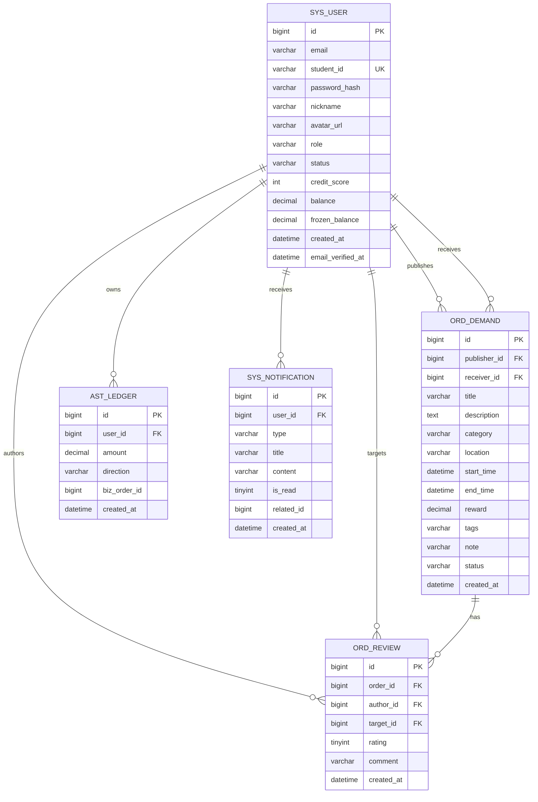

# Phase 3：详细设计文档

## 1. 文档目标

本阶段详细设计围绕校园互助平台的核心业务展开，目标是把 P2 的架构设计进一步落到可实现、可审查、可落库的设计粒度。本文档覆盖以下内容：

1. 核心类图与对象职责划分
2. SOLID 原则检查与修正记录
3. 核心接口 API 规范
4. 核心实体 ER 关系与建表说明
5. 设计模式应用说明
6. 简单推荐与管理后台功能设计

本设计以现有交付物中的接口规范、建表 SQL、SOLID 检查清单为基础，并统一到同一套领域命名：用户、需求、订单、评价、资产流水、通知。

## 2. 设计范围与分层

### 2.1 业务范围

P3 详细设计覆盖的核心业务包括：

1. 邮箱验证码注册、登录与身份认证
2. 发布需求、浏览需求、查看详情
3. 接单生成订单、查看订单详情
4. 提交评价、更新信用分
5. 站内通知推送与列表查询
6. 资产流水记录与余额一致性控制
7. 简单推荐（规则打分）
8. 管理后台（审核、封禁/解封、统计）

### 2.2 分层结构

系统采用模块化单体的分层组织方式，保持边界清晰但部署简单：

- 接口层：`AuthController`、`DemandController`、`OrderController`、`ReviewController`、`NotificationController`、`RecommendationController`、`AdminDemandController`、`AdminUserController`、`AdminStatsController`
- 应用层：`AuthApplicationService`、`DemandApplicationService`、`OrderApplicationService`、`ReviewApplicationService`、`NotificationApplicationService`、`RecommendationApplicationService`、`AdminDemandReviewService`、`AdminUserManageService`、`AdminStatsService`
- 领域层：`User`、`Demand`、`OrderReview`、`AssetLedgerEntry`、`Notification`、`RecommendationItem`
- 基础设施层：`UserRepository`、`DemandRepository`、`ReviewRepository`、`LedgerRepository`、`NotificationRepository`
- 领域协作：`DomainEventPublisher`、`SettlementPolicy`、`NotificationDispatcher`、`RecommendationRuleEngine`

这种划分的目的不是追求“形式上解耦”，而是把易变化的流程控制、持久化与通知投递从领域规则中拆开，降低后续改动面。

## 3. 核心类图设计

### 3.1 类图说明

核心类围绕用户、需求/订单、评价、资产流水、通知扩展到推荐与后台管理能力。为了满足 SOLID 原则，类图中引入应用服务、仓储接口、事件分发与规则引擎接口，避免业务对象直接依赖数据库实现。

可直接查看的类图文件见 [核心类图-修正版.svg](核心类图-修正版.svg)。下方 Mermaid 版本保留在文档中，便于阅读时快速理解关系（含简单推荐与管理后台核心对象）。

### 3.2 核心类图

```mermaid
classDiagram
direction LR

class User {
	+Long id
	+String email
	+String studentId
	+String passwordHash
	+String nickname
	+String avatarUrl
	+UserRole role
	+UserStatus status
	+int creditScore
	+BigDecimal balance
	+BigDecimal frozenBalance
	+LocalDateTime createdAt
	+LocalDateTime emailVerifiedAt
	+boolean verifyPassword(rawPassword)
	+void increaseCreditScore(delta)
	+void adjustBalance(amount)
}

class Demand {
	+Long id
	+Long publisherId
	+Long receiverId
	+String title
	+String description
	+String category
	+String location
	+LocalDateTime startTime
	+LocalDateTime endTime
	+BigDecimal reward
	+List~String~ tags
	+DemandStatus status
	+LocalDateTime createdAt
	+void accept(receiverId)
	+void close()
	+void cancel()
}

class OrderReview {
	+Long id
	+Long orderId
	+Long authorId
	+Long targetId
	+int rating
	+String comment
	+LocalDateTime createdAt
}

class AssetLedgerEntry {
	+Long id
	+Long userId
	+BigDecimal amount
	+LedgerDirection direction
	+Long bizOrderId
	+LocalDateTime createdAt
}

class Notification {
	+Long id
	+Long userId
	+NotificationType type
	+String title
	+String content
	+boolean read
	+Long relatedId
	+LocalDateTime createdAt
	+void markAsRead()
}

class RecommendationItem {
	+Long demandId
	+double score
	+int rank
	+List~String~ reasonTags
}

class AuthApplicationService {
	+void sendRegisterCode(String email)
	+User register(RegisterCommand)
	+AuthToken login(LoginCommand)
}

class DemandApplicationService {
	+Demand publish(PublishDemandCommand)
	+Page~Demand~ list(DemandQuery)
	+Demand getDetail(Long demandId)
}

class OrderApplicationService {
	+Demand accept(AcceptDemandCommand)
	+Demand getOrderDetail(Long orderId)
	+void cancel(Long orderId)
}

class ReviewApplicationService {
	+OrderReview submit(SubmitReviewCommand)
}

class NotificationApplicationService {
	+Page~Notification~ list(UserNotificationQuery)
	+void markAsRead(Long notificationId)
}

class RecommendationApplicationService {
	+Page~RecommendationItem~ recommend(Long userId, int page, int size)
}

class AdminDemandReviewService {
	+Demand review(Long demandId, String action, String reason, Long operatorId)
}

class AdminUserManageService {
	+Page~User~ listUsers(String q, int page, int size)
	+void banUser(Long userId, String reason, Long operatorId)
	+void unbanUser(Long userId, Long operatorId)
}

class AdminStatsService {
	+AdminStats viewDashboard()
}

class UserRepository {
	<<interface>>
	+Optional~User~ findById(Long id)
	+Optional~User~ findByStudentId(String studentId)
	+User save(User user)
}

class DemandRepository {
	<<interface>>
	+Optional~Demand~ findById(Long id)
	+Page~Demand~ search(DemandQuery query)
	+Demand save(Demand demand)
}

class ReviewRepository {
	<<interface>>
	+OrderReview save(OrderReview review)
	+List~OrderReview~ findByTargetId(Long targetId)
}

class LedgerRepository {
	<<interface>>
	+AssetLedgerEntry save(AssetLedgerEntry entry)
	+List~AssetLedgerEntry~ findByUserId(Long userId)
}

class NotificationRepository {
	<<interface>>
	+Notification save(Notification notification)
	+Page~Notification~ findByUserId(Long userId, boolean unreadOnly)
}

class DomainEventPublisher {
	<<interface>>
	+void publish(DomainEvent event)
}

class NotificationDispatcher {
	<<interface>>
	+void dispatch(DomainEvent event)
}

class SettlementPolicy {
	<<interface>>
	+void settle(Demand demand)
}

class RecommendationRuleEngine {
	<<interface>>
	+double score(Demand demand, User user)
	+List~String~ reasonTags(Demand demand, User user)
}

class DemandStatus {
	<<enumeration>>
	PENDING
	REVIEWING
	IN_PROGRESS
	COMPLETED
	CANCELLED
}

class LedgerDirection {
	<<enumeration>>
	IN
	OUT
	FREEZE
	UNFREEZE
}

class NotificationType {
	<<enumeration>>
	ORDER_ACCEPTED
	STATUS_CHANGED
	REVIEW_RECEIVED
}

class UserRole {
	<<enumeration>>
	USER
	ADMIN
}

class UserStatus {
	<<enumeration>>
	ACTIVE
	BANNED
}

AuthApplicationService ..> UserRepository
DemandApplicationService ..> DemandRepository
OrderApplicationService ..> DemandRepository
OrderApplicationService ..> UserRepository
OrderApplicationService ..> SettlementPolicy
OrderApplicationService ..> DomainEventPublisher
ReviewApplicationService ..> ReviewRepository
ReviewApplicationService ..> DemandRepository
ReviewApplicationService ..> UserRepository
ReviewApplicationService ..> DomainEventPublisher
NotificationApplicationService ..> NotificationRepository
DomainEventPublisher ..> NotificationDispatcher
RecommendationApplicationService ..> DemandRepository
RecommendationApplicationService ..> RecommendationRuleEngine
RecommendationApplicationService ..> UserRepository
AdminDemandReviewService ..> DemandRepository
AdminDemandReviewService ..> NotificationRepository
AdminUserManageService ..> UserRepository
AdminStatsService ..> DemandRepository
AdminStatsService ..> UserRepository

User "1" --> "0..*" Demand : publisher
User "1" --> "0..*" Demand : receiver
Demand "1" --> "0..*" OrderReview : reviews
User "1" --> "0..*" OrderReview : author
User "1" --> "0..*" OrderReview : target
User "1" --> "0..*" AssetLedgerEntry : ledger
User "1" --> "0..*" Notification : inbox
User "1" --> "0..*" RecommendationItem : gets
```



### 3.3 类职责说明

- `RecommendationApplicationService`：聚合规则引擎输出，分页返回推荐列表。

## 4. SOLID 检查清单

### 4.1 检查结论

AI 原始设计共识别出 5 处典型 SOLID 违规，五条原则各命中至少一处。最严重的问题是把发布、接单、结算、推荐、风控、通知、仲裁全部堆进一个 `CampusHubSystem`，形成典型“上帝类”。

### 4.2 检查表

| SOLID 原则 | 检查问题 | AI 设计是否违反 | 违反说明 | 修正方案 |
|-----------|---------|--------------|---------|---------|
| S - 单一职责 | 有没有类承担了过多职责？ | 是 | `CampusHubSystem` 同时负责认证、发布、接单、结算、风控、推荐、通知、仲裁，变化原因过多。 | 拆分为 `AuthApplicationService`、`OrderApplicationService`、`ReviewApplicationService`、`NotificationApplicationService` 等。 |
| O - 开闭原则 | 新增需求类型是否需要修改现有代码？ | 是 | 新增推荐规则、结算规则或通知渠道时，只能直接修改主流程类。 | 抽象 `SettlementPolicy`、`NotificationDispatcher` 等扩展点，通过新增实现类扩展功能。 |
| L - 里氏替换 | 子类是否可以替换父类使用？ | 是 | 原始设计没有明确状态抽象，若后续用继承表达订单状态，很容易出现不支持方法的状态类。 | 用状态枚举/状态对象约束合法迁移，避免不完整子类破坏替换性。 |
| I - 接口隔离 | 有没有接口太胖，包含了不需要的方法？ | 是 | 单一全能服务对象暴露过多方法，调用方被迫依赖不需要的能力。 | 按场景拆分窄接口，例如 `UserRepository`、`DemandRepository`、`NotificationRepository`。 |
| D - 依赖倒转 | 高层模块是否直接依赖了低层模块的具体实现？ | 是 | 业务入口直接操作具体数据结构，没有稳定抽象层。 | 高层服务只依赖仓储和策略接口，具体实现通过依赖注入提供。 |

### 4.3 设计修正说明

1. 将“业务编排”与“持久化细节”拆开，避免一个类既做流程控制又做数据访问。
2. 将“状态变化”“通知发送”“资金结算”拆成可替换策略，便于后续扩展。
3. 将“订单评价”“资产流水”设计为独立聚合，减少对主订单对象的侵入。

## 5. 设计模式应用

### 5.1 状态模式：需求/订单状态流转

#### 为什么使用

需求从发布到接单再到完成，天然具有状态机特征。使用状态模式后，状态迁移规则不再散落在大量 `if-else` 中，而是由状态对象或状态枚举集中维护。

#### 不使用会怎样

如果直接把状态判断写在服务方法中，随着“取消、超时、申诉、退款、二次接单”等需求增加，主流程会迅速膨胀，测试也会越来越难覆盖。

#### 设计落点

- `DemandStatus` 记录需求当前状态
- `Demand.accept()`、`Demand.close()`、`Demand.cancel()` 只允许合法迁移
- 应用服务只负责调用状态迁移，不直接拼接状态判断

### 5.2 观察者模式：订单事件驱动通知

#### 为什么使用

接单、评价、状态变更后，通常要同时触发多项副作用：发送站内通知、更新信用分、记录资产流水、同步审计日志。观察者模式能把这些副作用与主流程解耦。

#### 不使用会怎样

如果在 `OrderApplicationService` 中直接写入通知、信用分和流水逻辑，服务会越来越臃肿，而且每新增一个副作用都要修改主业务代码。

#### 设计落点

- `DomainEventPublisher` 发布 `DemandAcceptedEvent`、`ReviewSubmittedEvent` 等领域事件
- `NotificationDispatcher` 监听事件并生成通知
- 信用分更新和流水记录也可以作为事件消费者实现

### 5.3 策略模式：结算策略与排序策略

#### 为什么使用

未来不同业务场景可能需要不同的结算规则或列表排序规则，例如按时间、按距离、按悬赏排序。策略模式可将这些变化点抽离成独立实现。

#### 不使用会怎样

若把排序规则和结算规则写死在查询或服务方法里，后续新增场景时只能改原方法，违反开闭原则。

#### 设计落点

- `SettlementPolicy` 统一结算入口
- 需求列表排序可扩展为 `TimeSortStrategy`、`DistanceSortStrategy`、`RewardSortStrategy`

### 5.4 策略模式（扩展）：简单推荐规则引擎

#### 为什么使用

简单推荐需要按规则组合打分，规则随业务迭代会持续变化（同分类、历史偏好、距离、时间窗）。将推荐逻辑做成策略组合可避免在单个方法中写死。

#### 不使用会怎样

若把所有推荐规则写在一个服务方法中，新增或调整权重会频繁修改主流程，导致可维护性下降且难以 A/B 验证。

#### 设计落点

- `RecommendationRuleEngine` 抽象评分与理由生成。
- 推荐结果统一输出 `score`、`rank`、`reasonTags`。
- 规则优先级采用：同分类 > 历史偏好 > 距离 > 时间匹配。

## 6. API 设计

本节与 `docs/P3/API规范.md` 保持一致，并补充成可直接用于详细设计文档的形式。接口统一采用 RESTful 风格，基路径为 `/api/v1`。

### 6.1 通用约定

#### 通用响应结构

成功：

```json
{
	"code": 0,
	"message": "OK",
	"data": {}
}
```

失败：

```json
{
	"code": 1002,
	"message": "参数校验失败",
	"errors": {
		"password": "长度至少 8 位"
	}
}
```

#### HTTP 状态码约定

- 200：成功
- 400：参数校验失败
- 401：未认证或认证失败
- 403：权限不足
- 404：资源未找到
- 409：业务冲突，例如重复注册、重复接单
- 500：服务器内部错误

#### 错误码约定

| 错误码 | 含义 |
|------|------|
| 1001 | 认证失败，Token 无效或过期 |
| 1002 | 参数校验失败 |
| 1003 | 资源未找到 |
| 1004 | 权限不足 |
| 1005 | 业务冲突，例如重复接单 |

### 6.2 接口清单

#### 1）发送注册验证码

- URL：`POST /api/v1/auth/email-code`
- 描述：向学校邮箱发送注册验证码
- 请求体：
	- `email` string，必填，学校邮箱
	- `studentId` string，可选，学号/业务标识
- 响应：
	- 成功：验证码已发送，返回过期时间
	- 失败：400 参数校验失败，409 邮箱已绑定或发送过于频繁，500 服务器错误

#### 2）用户注册

- URL：`POST /api/v1/auth/register`
- 描述：校验邮箱验证码后完成注册
- 请求体：
	- `email` string，必填，学校邮箱
	- `verificationCode` string，必填，邮箱验证码
	- `studentId` string，必填，长度 3-64，学号/业务标识
	- `password` string，必填，至少 8 位
	- `nickname` string，可选，最长 64
	- `avatarUrl` string，可选，URI 格式
- 响应：
	- 成功：返回用户概要，不包含密码
	- 失败：400 参数校验失败，409 邮箱已绑定/验证码失效/学号已注册，500 服务器错误

#### 3）用户登录

- URL：`POST /api/v1/auth/login`
- 描述：邮箱或学号 + 密码登录，返回 JWT
- 请求体：
	- `loginId` string，必填，邮箱或学号
	- `password` string，必填
- 响应：
	- 成功：`token`、`expiresIn`、`user`
	- 失败：400 参数校验失败，401 认证失败，500 服务器错误

#### 4）发布需求

- URL：`POST /api/v1/demands`
- 权限：需登录
- 请求体：
	- `title` string，必填，3-200 字符
	- `description` string，可选，最长 2000
	- `category` string，必填
	- `location` string，可选，最长 256
	- `startTime` string，可选，ISO8601
	- `endTime` string，可选，ISO8601
	- `reward` number，可选，最小 0
	- `tags` string[]，可选，最多 20 项
- 响应：
	- 成功：新的需求对象
	- 失败：400 参数校验失败，401 未认证，500 服务器错误

#### 5）浏览需求列表（含筛选）

- URL：`GET /api/v1/demands`
- 描述：按条件查询需求，支持分页
- 查询参数：
	- `q` string，可选
	- `category` string，可选
	- `location` string，可选
	- `startTimeFrom` string，可选
	- `startTimeTo` string，可选
	- `sort` string，可选，枚举 `time`、`distance`、`reward`，默认 `time`
	- `page` integer，可选，默认 1
	- `size` integer，可选，默认 20，范围 1-100
- 响应：
	- 成功：`items`、`page`、`size`、`total`
	- 失败：400 参数校验失败，500 服务器错误

#### 6）需求详情

- URL：`GET /api/v1/demands/{demandId}`
- 描述：查看单条需求详情
- 路径参数：`demandId`
- 响应：
	- 成功：需求对象，包含发布者概要
	- 失败：404 未找到，500 服务器错误

#### 7）接单（创建订单）

- URL：`POST /api/v1/demands/{demandId}/accept`
- 权限：需登录
- 描述：服务方接受某条需求，系统创建订单并通知双方；如果已经被接单则返回冲突
- 请求体：
	- `note` string，可选，最长 500
- 响应：
	- 成功：订单对象，包含 `orderId` 和 `status=accepted`
	- 失败：400 参数校验失败，401 未认证，403 权限不足，409 操作冲突，500 服务器错误

#### 8）查看订单详情

- URL：`GET /api/v1/orders/{orderId}`
- 权限：需登录，且必须是订单参与方或管理员
- 响应：
	- 成功：订单详情，包含需求、双方用户概要、状态变更记录
	- 失败：401 未认证，403 权限不足，404 未找到，500 服务器错误

#### 9）提交评价

- URL：`POST /api/v1/orders/{orderId}/reviews`
- 权限：需登录，且只有订单双方在订单完成后可提交
- 请求体：
	- `rating` integer，必填，范围 1-5
	- `comment` string，可选，最长 1000
- 响应：
	- 成功：评价记录
	- 失败：400 参数校验失败，401 未认证，403 权限不足，500 服务器错误

#### 10）消息通知列表

- URL：`GET /api/v1/notifications`
- 权限：需登录
- 描述：查询当前用户收到的站内消息
- 查询参数：
	- `unreadOnly` boolean，可选，默认 false
	- `page` integer，可选，默认 1
	- `size` integer，可选，默认 20，范围 1-100
- 响应：
	- 成功：`items`、`page`、`size`、`total`
	- 失败：401 认证失败，500 服务器错误

#### 11）简单推荐列表

- URL：`GET /api/v1/recommendations`
- 权限：需登录
- 描述：基于当前用户历史行为、分类偏好、位置与时间规则返回推荐需求
- 查询参数：
	- `page` integer，可选，默认 1
	- `size` integer，可选，默认 10，最大 50
- 响应：
	- 成功：`items`（含 `demandId`、`score`、`rank`、`reasonTags`）、`page`、`size`、`total`
	- 失败：401 未认证，500 服务器错误

#### 12）管理后台接口

- 基础权限：管理员角色（JWT 中包含 `role=ADMIN`）
- 主要接口：
	- `GET /api/v1/admin/demands/pending`：查询待审核需求
	- `POST /api/v1/admin/demands/{demandId}/review`：审核需求（`approve` / `reject`）
	- `GET /api/v1/admin/users`：查询用户列表
	- `POST /api/v1/admin/users/{userId}/ban`：封禁用户
	- `POST /api/v1/admin/users/{userId}/unban`：解封用户
	- `GET /api/v1/admin/stats`：统计看板
- 响应：
	- 成功：统一 `code=0`，`data` 为对应业务对象
	- 失败：401 未认证，403 权限不足，500 服务器错误

### 6.3 安全与校验说明

- 密码必须使用强散列算法存储，例如 bcrypt 或 argon2，不允许明文落库。
- 受保护接口统一采用 JWT Bearer Token。
- 管理后台接口必须校验管理员角色（RBAC），普通用户访问返回 403。
- 写接口必须校验身份与权限，尤其是接单、查看订单、提交评价等操作。
- 列表接口必须限制分页大小，避免一次性返回过多数据。
- 接单属于非幂等操作，必须通过事务、行锁或乐观锁保证并发一致性。
- 推荐接口需限制 `size<=50`，且对位置信息采取最小化使用与脱敏策略。

## 7. 数据库设计

### 7.1 核心实体

本阶段核心实体与数据库表对应关系如下：

| 实体 | 表名 | 说明 |
|------|------|------|
| 用户 | `sys_user` | 用户身份、密码摘要、信用分、余额 |
| 需求/订单主表 | `ord_demand` | 需求发布、接单与订单状态流转 |
| 评价 | `ord_review` | 订单完成后的双向评价 |
| 资产流水 | `ast_ledger` | 余额与冻结金额流水 |
| 通知 | `sys_notification` | 站内消息 |

说明：本轮迭代的“简单推荐”和“管理后台”不新增独立核心业务表，主要复用现有表并通过字段扩展支持；注册流程新增邮箱验证码能力，`sys_user` 需要同时保留邮箱与学号：

- `sys_user.email`：用于验证码注册与登录。
- `sys_user.role`、`sys_user.status`：支持管理员与封禁状态。
- `ord_demand.status`：支持 `REVIEWING` 审核状态。
- 推荐结果采用在线规则计算，不持久化为独立推荐表。

### 7.2 ER 图

可直接查看的 ER 图文件见 [ER图.png](ER图.png)。下方 Mermaid 版本保留在文档中，便于文字化审阅实体关系。



### 7.3 建表 SQL 设计说明

建表语句以 `docs/P3/建表SQL.txt` 为准，核心设计要点如下：

#### 1）`sys_user`

- 主键：`id`
- 唯一索引：`email`，防止重复邮箱注册
- 唯一索引：`student_id`，保留学号业务标识并防止重复绑定
- 密码：仅存 `password_hash`
- 角色与状态：`role`（USER/ADMIN）、`status`（ACTIVE/BANNED）
- 约束：`chk_user_role`、`chk_user_status`
- 邮箱验证码注册：`email_verified_at` 记录邮箱完成验证时间
- 余额字段：`balance` 与 `frozen_balance` 分离，便于冻结与解冻

#### 2）`ord_demand`

- 主键：`id`
- 管理后台审核状态：`status` 支持 `REVIEWING`
- 标签：使用 `tags` 字符串（逗号分隔）以简化实现
- 接单留言：`note`
- 约束：`chk_demand_category`、`chk_demand_status`

#### 3）`ord_review`

- 约束：`rating` 限定在 1 到 5
- 采用逻辑外键（应用层维护关联一致性）

#### 4）`ast_ledger`

- 流水为不可变记录，只能新增冲正，不做更新或删除
- 所有余额修改必须与流水写入在同一事务中完成
- 约束：`direction` 仅允许 `IN/OUT/FREEZE/UNFREEZE`

#### 5）`sys_notification`

- `related_id` 为多态关联字段，可关联需求、订单或评价
- 约束：`type` 限定为 `ORDER_ACCEPTED/STATUS_CHANGED/REVIEW_RECEIVED`
- 本版采用物理存在即有效记录，不引入 `is_deleted`

### 7.4 隐私与安全处理

- 密码必须以强哈希保存，不允许使用可逆加密存储。
- 管理后台能力依赖 `role` 和 `status` 字段，所有后台操作必须记录 `operatorId` 与 `reason`（在应用日志或审计日志中）。
- 当前核心表没有手机号字段；如果后续扩展手机号、身份证号等敏感信息，应采用列级加密、脱敏展示和最小权限访问控制。
- 通知、评价内容等用户生成内容需保留审计能力，避免物理删除。

## 8. 结论

本次详细设计已经完成从需求到类、接口、表结构、索引和设计模式的落地。相较于 AI 初稿，修正版重点做了三类修正：

1. 把“单体大类”拆成职责明确的应用服务与领域对象
2. 把“接口和状态”抽象成可扩展契约，减少未来修改面
3. 把“数据库一致性和审计”显式写入设计约束，而不是留给实现时临时补
4. 增加简单推荐与管理后台能力，并通过 RBAC 与审核状态控制保证可运维性
5. 将注册方式统一为邮箱验证码，同时保留学号作为业务标识，避免认证凭证和校园标识混淆